# 🏢 BCU Building Management System

### Home Assistant-Based BMS Integration for Building Automation & Energy Management

Building Management System implemented for the **Central University Library of Cluj-Napoca**, developed as part of my professional work in building automation.

The system integrates lighting, HVAC, ventilation, pumps, energy monitoring and multiple automation subsystems into a centralized **Home Assistant** interface.

The project combines **KNX, DALI, Modbus and Ethernet communication** across multiple buildings and technical systems.

---

## 🧩 System Overview

The BMS integrates and supervises several major building systems:

- 💡 Architectural lighting
- 🔌 KNX-DALI lighting automation
- 📚 Book storage lighting control
- 🚶 Presence-based lighting logic
- ♻️ Heat recovery units
- 🌬️ Air Handling Units
- ❄️ VRF heating and cooling
- 🌡️ Fan Coil Unit control
- 💧 Pump control
- ⚡ Energy monitoring
- ☀️ Photovoltaic inverter integration
- 🌐 Building-to-building Ethernet communication
- 🖥️ Centralized web supervision through Home Assistant

---
## 🖥️ BMS Interface Screenshots

The following screenshots present selected views from the Home Assistant-based BMS interface used for monitoring and control of the building systems.

### 🏢 Central Building


---

### 🌬️ Air Handling Units

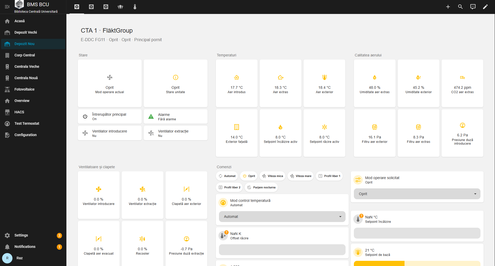


---

### 📊 Main Dashboards

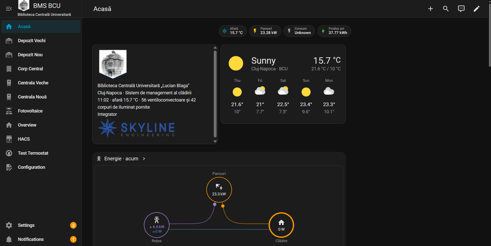

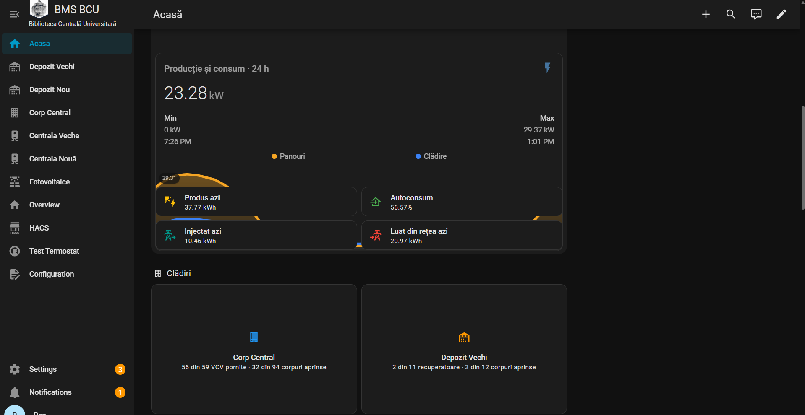

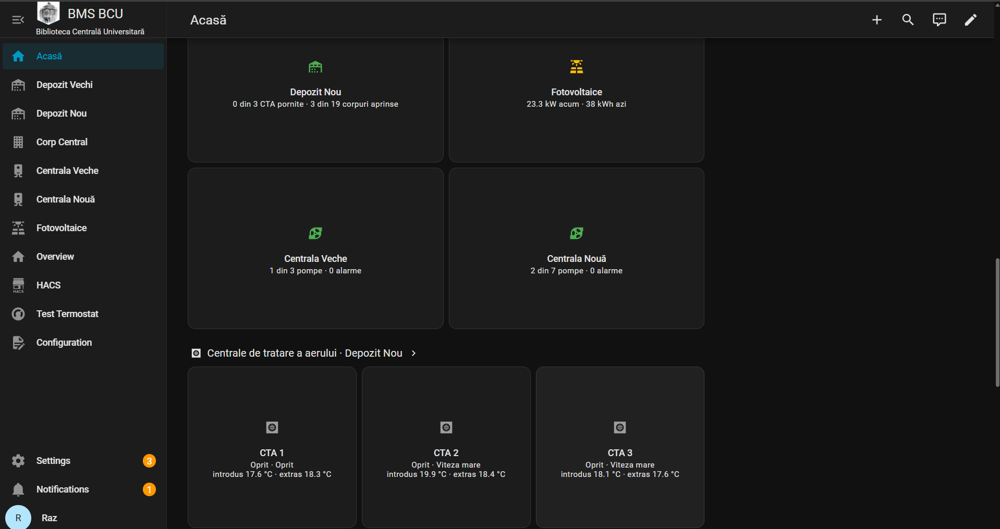

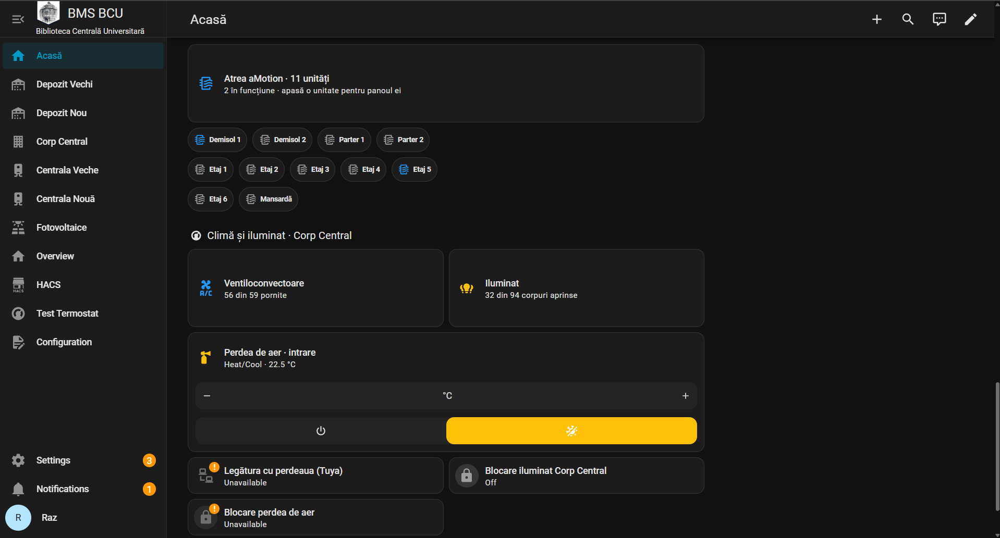

---

### ☀️ Photovoltaic Monitoring

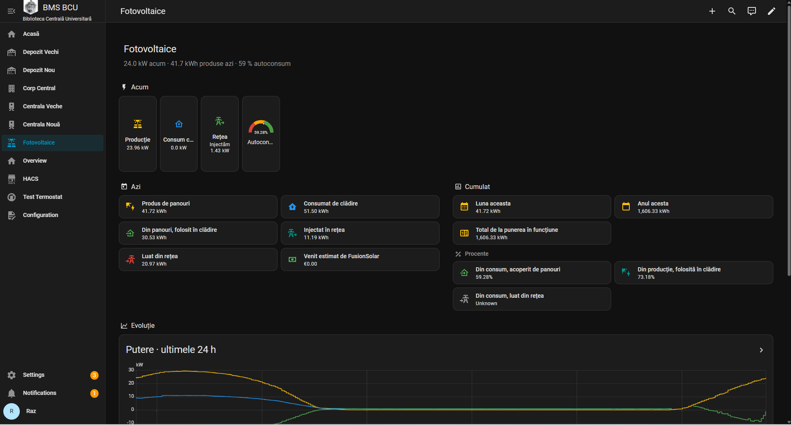

---

### 💡 Lighting Control


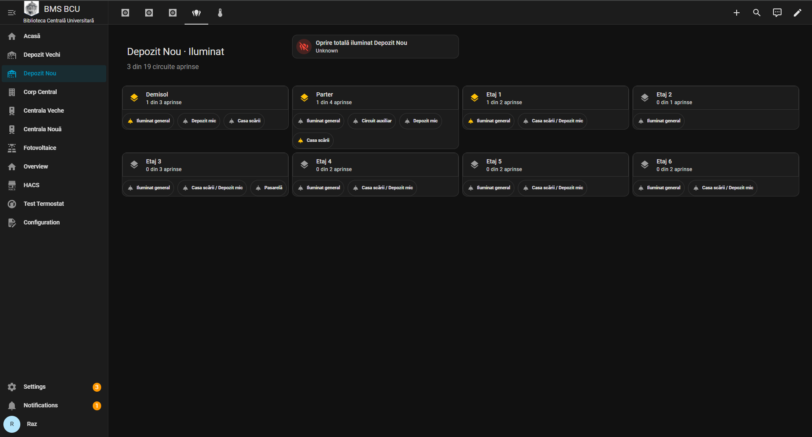

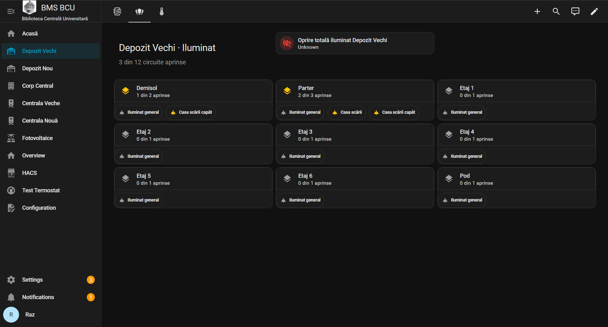

---

### ♻️ Heat Recovery Units

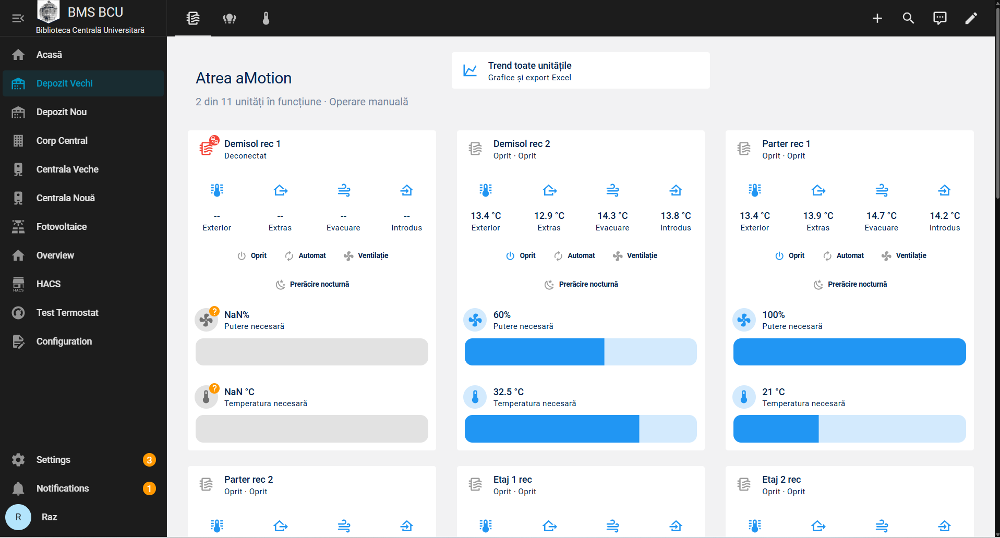

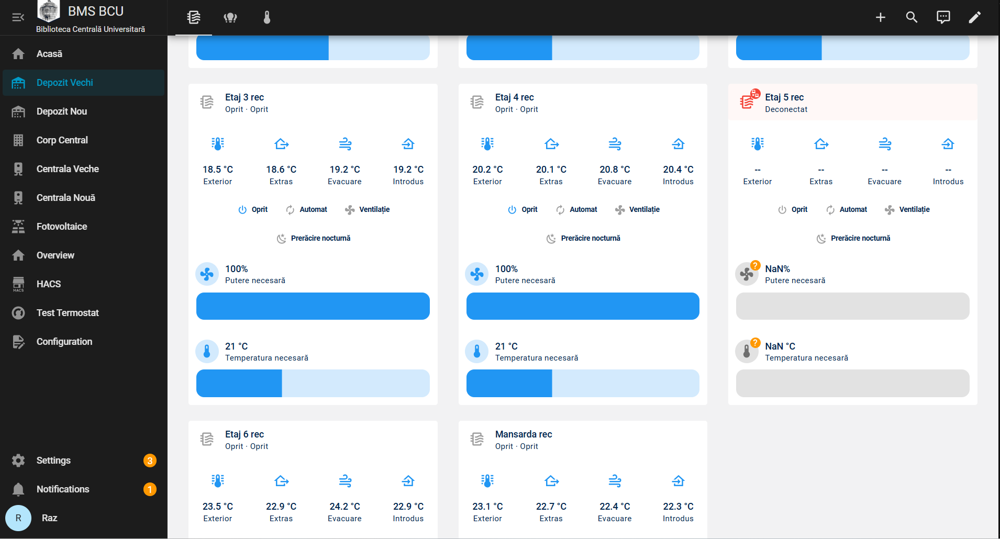

---

### 🌡️ Fan Coil & Room Control

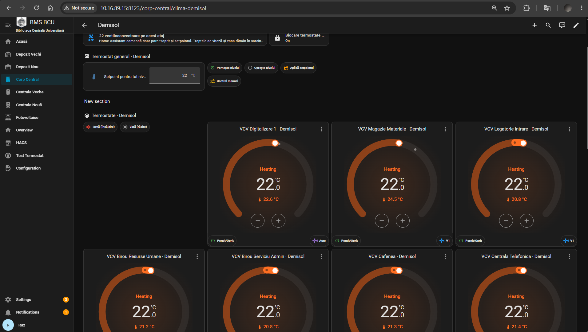
## 💡 Lighting Automation

### 🌇 Architectural Lighting

Architectural lighting is automatically controlled based on **sunset time**, allowing the lighting system to follow natural daylight conditions.

---

### 📚 Book Storage Areas

The book storage areas use a **KNX-DALI lighting control architecture**.

Each shelving area includes:

- 💡 2 lighting fixtures
- 🚶 1 KNX presence sensor

The control logic operates as follows:

1. When presence is detected in the main corridor, all shelving rows are activated at **20% brightness**.
2. When a person enters a specific shelving aisle, the corresponding lighting increases to **100%**.
3. When the aisle is no longer occupied, the lighting returns to the predefined standby or off state.
4. The lighting logic is designed to improve energy efficiency while maintaining safe and comfortable illumination.

---

### ⏱️ Scheduled Lighting Control

Lighting in the book storage areas and the central building is automatically switched off according to a predefined operating schedule developed together with the client.

This ensures that lighting is not left active outside the required operating hours.

---

## 🌡️ HVAC & Ventilation Integration

The Home Assistant-based BMS integrates:

- ♻️ **11 Heat Recovery Units**
- 🌬️ **3 Air Handling Units (AHUs)**
- ❄️ VRF systems for heating and cooling in the book storage areas
- 🌡️ Fan Coil Units (FCUs) for heating and cooling in the central building

The systems can be monitored and controlled from a centralized web interface.

Main functions include:

- 📊 Operating status monitoring
- 🌡️ Temperature supervision
- 🔥 Heating and cooling control
- ⏯️ System enable / disable
- 🖥️ Equipment status visualization
- 🎛️ Centralized supervision

---

## ❄️ VRF & Fan Coil Control

Heating and cooling in the book storage areas are provided through **VRF systems**.

The central building uses **Fan Coil Units** for local temperature regulation.

The BMS allows centralized monitoring and control of temperature-related systems through the Home Assistant interface.

---

## 💧 Pump Control & Modbus Integration

Pumps are integrated using **Modbus communication**.

The data points are mapped through a **Schneider Electric LSS100200 logical controller**, which allows Modbus devices to be integrated into the wider building automation system.

Functions include:

- 📡 Pump status monitoring
- 🎛️ Command and control
- 🗺️ Data point mapping
- 🔗 Integration into the centralized BMS interface

---

## 🔌 KNX Infrastructure

The building automation infrastructure is based on **Schneider Electric KNX equipment**.

The KNX system is used for:

- 💡 Lighting automation
- 🚶 Presence detection
- 🔗 DALI integration
- ⚙️ Control logic
- 🌡️ Local temperature control
- 🌀 Fan Coil Unit control
- 🎚️ Fan speed control
- 🔥 / ❄️ Heating and cooling demand
- 🚰 Valve control based on room temperature
- 📡 Communication between field devices and control systems

### 🖥️ 4" KNX Touch Units

4-inch KNX touch units are used as local room interfaces for both **comfort control and lighting management**.

Through the touch interface, users can:

- Adjust the room temperature setpoint
- Control Fan Coil Unit operation
- Select or manage fan speeds
- Control heating / cooling valves based on temperature demand
- Control room lighting

The touch units act as local user interfaces within the KNX automation system, while the control logic coordinates the room conditions and connected equipment.

---
## 💡 KNX-DALI Integration

DALI lighting is integrated into the KNX infrastructure to provide flexible lighting control.

This allows:

- 🎚️ Individual or grouped lighting control
- 🔆 Dimming
- 🚶 Occupancy-based control
- ⏱️ Scheduled control
- ⚡ Energy-efficient lighting strategies

---


## 🌐 Ethernet Network

All buildings communicate through a shared **Ethernet network**.

This allows the different building automation subsystems to exchange data and enables centralized supervision from the BMS interface.

```text
                           Ethernet Network
                                  │
          ┌───────────────────────┼───────────────────────┐
          │                       │                       │
          ▼                       ▼                       ▼
     Building A              Building B              Building C
          │                       │                       │
          └───────────────────────┴───────────────────────┘
                                  │
                                  ▼
                       Home Assistant / BMS
